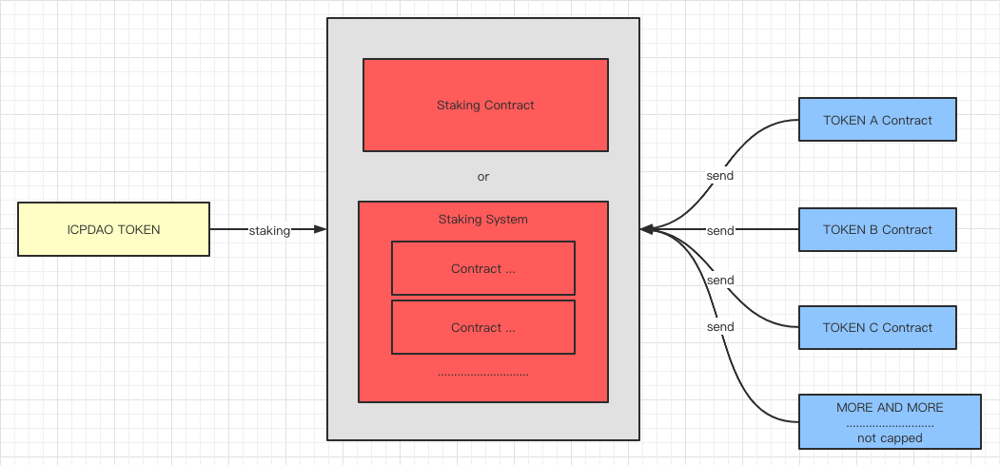

# 推荐一个满足需求的以太坊质押合约

### 奖励

100个DAI

### 提交物

推荐一个以太坊质押合约，或者是几个合约构成的质押系统。

需要提交一个PR，包括一个文档，文档的内容如下：

1. 推荐的合约在以太坊链上的地址。

2. 合约的结构介绍，能够说明它确实满足了要求。

3. 合约的github源码仓库地址。

### 要求

1. 这套质押合约必须是被验证过，并且在线上运行半年以上。

2. 必须满足所有要求，不能是类似的，比如 SushiSwap 的 MasterChef 有一定相似性，但是不行。

3. 要求如下：

1. ICPDAO TOKEN 必须是 ERC20 合约。

2. TOKEN A ,TOKEN B ,TOKEN C 等等也必须是 ERC20 合约，并且数量上没有上限。

3. 持有 ICPDAO TOKEN 的投资者，可以把一定数量的 TOKEN 放入质押合约进行质押，产生收益。

4. TOKEN A ,TOKEN B,TOKEN C 等等它们会周期性的被转账进入质押合约。

5. 这些 TOKEN A ,TOKEN B ,TOKEN C 等等就是质押 ICPDAO TOKEN 产生的收益，质押合约需要按照  ICPDAO TOKEN 的质押比例合理的把 TOKEN A ,TOKEN B ,TOKEN C 分配给质押者。

6. 质押者可以随时查看自己分得的 TOKEN A ,TOKEN B ,TOKEN C等等这些收益，并把收益的各种 TOKEN 提取出来。

7. 任何人都可以随时参加质押，增加质押，退出质押。