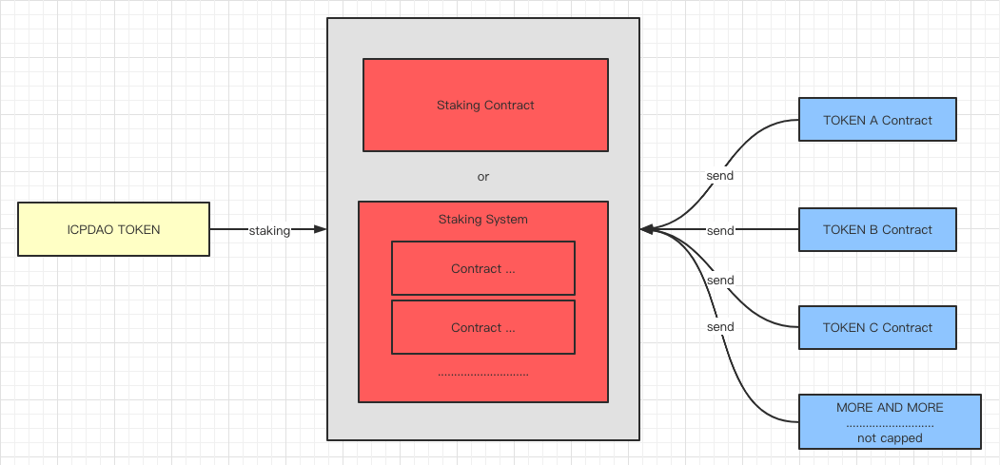

# Recommend an ethereum staking Smart Contract that meets the requirements

### Reward

100 DAI

### Acceptance Criteria

Recommend an ethereum staking Smart Contract

A PR needs to be submitted that includes a document with the following content:

1. The address of the recommended contract on the ethereum chain.

2. Link to the github source code repository for the contract.

3. The presentation of the contract is able to show that it does meet the requirements.

### Requirements of the Smart Contract

1. The contracts must be verified and have been online for at least six months.

2. Must meet all requirements, cannot be similar, e.g. SushiSwap's MasterChef has some similarity, but no.

3. Look at the pictures and descriptions below:

   1. ICPDAO TOKEN must be an ERC20 contract.

   2. TOKEN A, TOKEN B, TOKEN C, etc. must also be ERC20 contracts, and there is no upper limit on the number of contracts.

   3. Anyone can stake their ICPDAO TOKEN into the staking contract to generate income.

   4. TOKEN A, TOKEN B, TOKEN C, etc. They are periodically transferred into staking contracts.

   5. These TOKEN A, TOKEN B, TOKEN C, etc. are the income generated by staking ICPDAO TOKEN, and the staking contract requires that TOKEN A, TOKEN B, TOKEN C be reasonably allocated to the People who staking ICPDAO TOKEN in accordance with the staking ratio of ICPDAO TOKEN. 

   6. People who staking ICPDAO TOKEN can view their TOKEN A, TOKEN B, TOKEN C, etc. income at any time and withdraw them.

   7. Anyone can add staking, update staking, remove staking, Withdrawal of income and withdraw at any time.